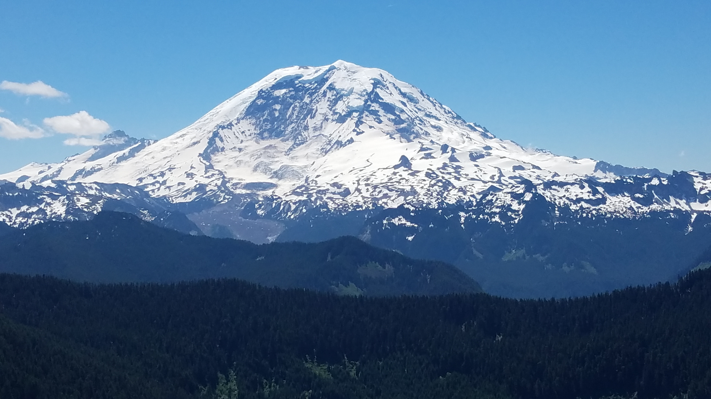
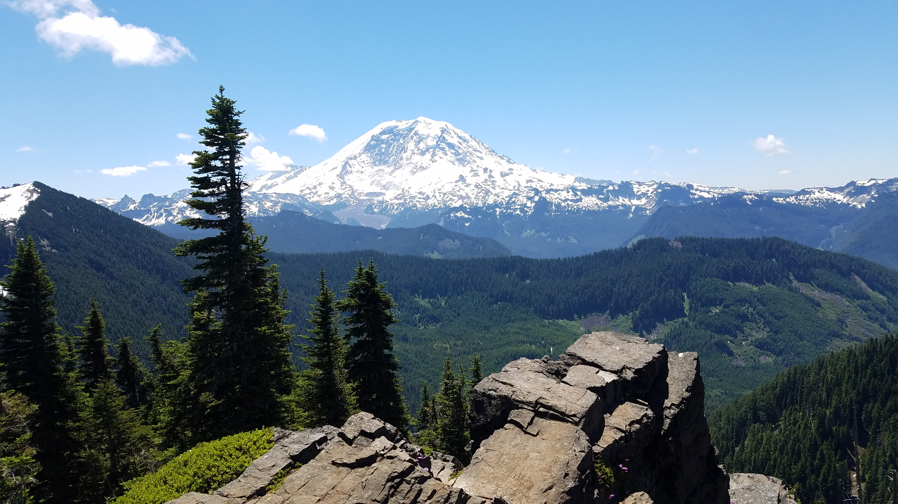
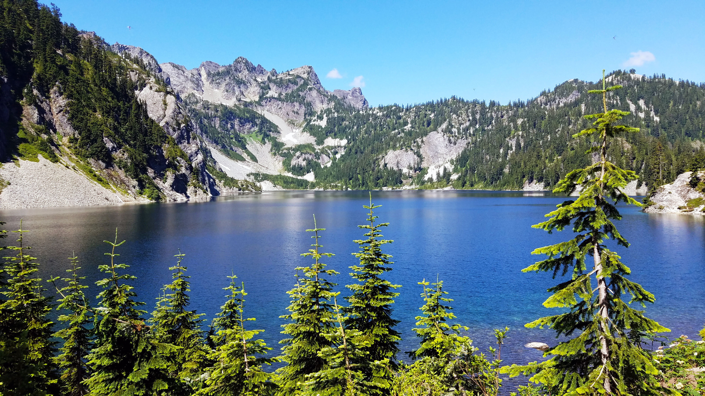

# Visit Washington

`echo Hello Washington!`

---

## Why visit Washington? Good question.
> Washington has to be the best state in the country. It has it all. I've lived here all my life and never get tired of the places I see and the things I do. I recommend everyone not from Washington take a trip, or maybe even stay a little longer! All the picture below were taken by me.

---

### Mountains
Washington is home to a countless number of mountains and beautiful forests. On the coast you can find the Olympic Mountains and splitting the state in half is the North Cascades, home to the 17th tallest mountain in the Unites States: __Mount Rainier__ ***(~14,000 ft!)***

This breathtaking picture was taken just over an hour drive from my house. Yes, really. Hike's like these are accessible no matter where you live in Washington. You could see views like these every weekend with barely any travel time! Here's a couple images of Washington hikes:

### Beaches
Beaches, we got those too. Washington's western friend is the Pacific Ocean. Now these beaches aren't like those found in Miami, Florida ***(the water is very cold!)***, but that doesn't mean it isn't magnificent in and of itself. I mean, just check this out-

There's still plenty to do at the beaches too. If you come to a Washington beach, maybe try some of these things out:
- Scuba Diving
- Fishing
- Flying kites
- Wildlife viewing
- Surfing
- Sticking your feet in the water!

### Seattle
If you find you way to this city, you'll be right on top of iconic locations such as __[Pike Place Market](http://pikeplacemarket.org/)__ and the __[Space Needle](https://www.spaceneedle.com/)__.

***Image found at https://en.wikipedia.org/wiki/Seattle***

-but that's not all. Check out this list on Tripadvisor of some of the [best things to do in Seattle](https://www.tripadvisor.com/Attractions-g60878-Activities-Seattle_Washington.html)

---
#### Now that you've taken the time to read a little bit about the diversity of Washington, I took the liberty of make a checklist for you

- [x] Read about why Washington is great
- [x] Get super excited about it
- [x] Tell all my friends
- [x]  Get ready for the trip
- [ ] Visit Washington

#### We hope to see you soon!
##### ***Check out more at [kcroland.github.io](https://kcroland.github.io/)***
